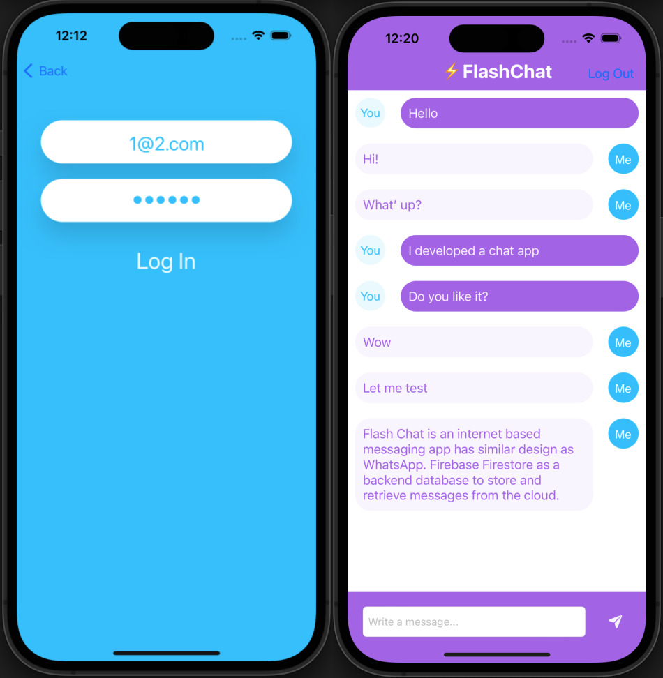
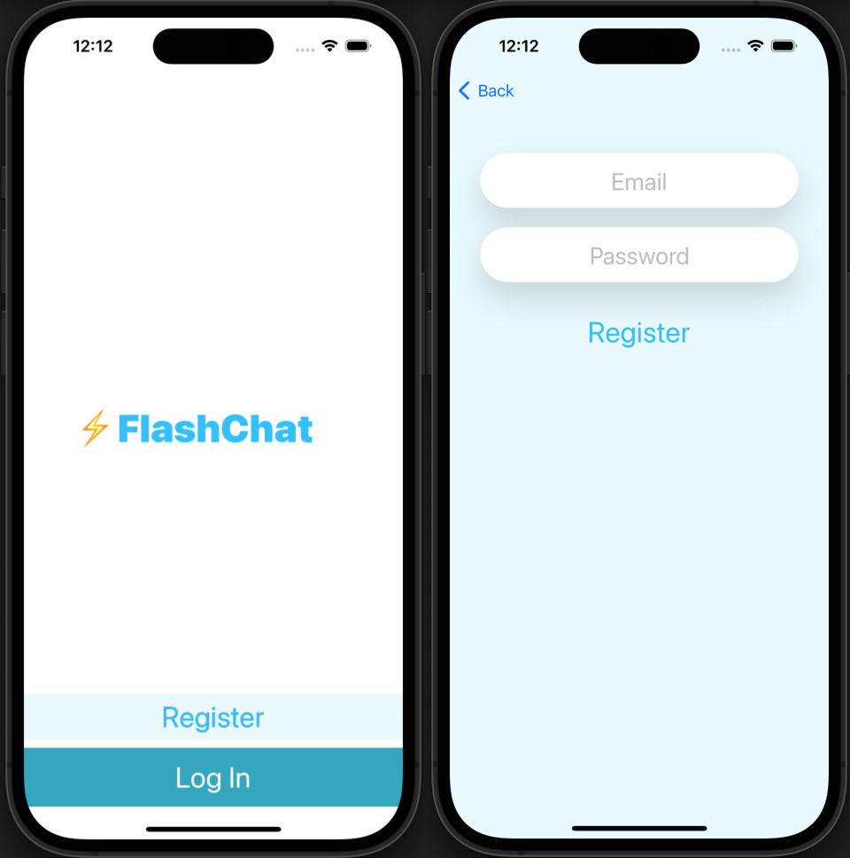

# Flash Chat
## Project summary
Flash Chat is an internet based messaging app has similar design as WhatsApp. Firebase Firestore as a backend database to store and retrieve messages from the cloud.

## Technical Points
### Firebase
- store data in the cloud using Firebase Firestore.
- query and sort the Firebase database.
- use Firebase for user authentication, registration and login.
### Swift
- work with UITableViews and how to set their data sources and delegates.
- create custom views using .xib files to modify native design components.
- embed View Controllers in a Navigation Controller and understand the navigation stack.
- create a constants file and use static properties to store Strings and other constants.
- Using Swift loops and create animations using loops.
- learn about the App Lifecycle and how to use viewWillAppear or viewWillDisappear.
- create direct Segues for navigation.
- integrate third party libraries in your app using Cocoapods and Swift Package Manager.

